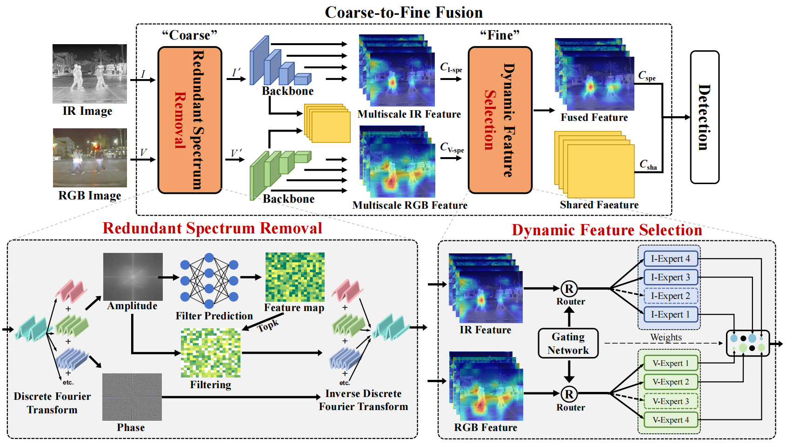

<div align="center">
<h1>(TITS 2026) RSDet </h1>
<h2>Removal Then Selection: A Coarse-to-Fine Fusion Perspective for RGB-Infrared Object Detection</h2>


</div>





## Citation
Paper Link: [IEEE Trans-ITS](https://ieeexplore.ieee.org/document/11278552)
```
@ARTICLE{11278552,
  author={Zhao, Tianyi and Yuan, Maoxun and Jiang, Feng and Wang, Nan and Wei, Xingxing},
  journal={IEEE Transactions on Intelligent Transportation Systems}, 
  title={Removal Then Selection: A Coarse-to-Fine Fusion Perspective for RGB-Infrared Object Detection}, 
  year={2026},
  volume={27},
  number={2},
  pages={2504-2519},
  keywords={Object detection;Feature extraction;Lighting;Detectors;Information filters;Filtering theory;Representation learning;Attenuation;Reliability;Location awareness;Coarse-to-fine fusion;mixture of experts;multisensory fusion;RGB-IR object detection},
  doi={10.1109/TITS.2025.3638627}}

```


## Getting Started

### Installation

Refer to the official mmdet documentation : [mmdetection installation](https://mmdetection.readthedocs.io/en/latest/get_started.html)

**Step 1: Clone the RSDet repository:**

To get started, first clone the RSDet repository and navigate to the project directory:

```bash
git clone https://github.com/Zhao-Tian-yi/RSDet.git
cd RSDet
```

**Step 2: Environment Setup:**

RSDet recommends setting up a conda environment and installing dependencies via pip. Use the following commands to set up your environment:

***Create and activate a new conda environment***

```bash
conda create -n RSDet python=3.7
conda activate RSDet
```

***If you develop and run mmdet directly, install it from source***

```
pip install -v -e .
```

***Install Dependencies***

```bash
pip install -r requirements.txt
pip install -r requirements_rgbt.txt
```


## Data Preparation

This repository uses relative dataset paths by default. Place datasets under `data/` or update the corresponding `data_root` in the dataset config files under [`configs/_base_/datasets`](./configs/_base_/datasets).

Suggested directory layout:

```text
RSDet/
├── Datasets_Dir/
│   ├── FLIR_align/
│   ├── LLVIP/
│   ├── M3FD/
│   ├── MFAD/
│   └── KAIST/
└── pretrain/
    └── resnet50_cityscape.pth
```

dataset base configs:

- [`configs/_base_/datasets/FLIR.py`](./configs/_base_/datasets/FLIR.py)
- [`configs/_base_/datasets/LLVIP.py`](./configs/_base_/datasets/LLVIP.py)
- [`configs/_base_/datasets/M3FD.py`](./configs/_base_/datasets/M3FD.py)
- [`configs/_base_/datasets/MFAD.py`](./configs/_base_/datasets/MFAD.py)
- [`configs/_base_/datasets/KAIST.py`](./configs/_base_/datasets/KAIST.py)

## Pretrained Backbone

The released RSDet configs expect the backbone checkpoint at: [Download Link](https://pan.baidu.com/s/1RsRpnRNuwIPC2eilGWQ-fQ?pwd=m6cc)

```text
pretrain/resnet50_cityscape.pth
```

If you want to use a different pretrained checkpoint, update the `pretrained_backbone` variable in the corresponding config file.

## Available RSDet Configs

This branch currently includes the following paper-aligned RSDet configs:

- [`configs/fusion/RSDet/faster_rcnn_r50_rsdet_FLIR.py`](./configs/fusion/RSDet/faster_rcnn_r50_rsdet_FLIR.py)
- [`configs/fusion/RSDet/faster_rcnn_r50_rsdet_KAIST.py`](./configs/fusion/RSDet/faster_rcnn_r50_rsdet_KAIST.py)
- [`configs/fusion/RSDet/faster_rcnn_r50_rsdet_LLVIP.py`](./configs/fusion/RSDet/faster_rcnn_r50_rsdet_LLVIP.py)
- [`configs/fusion/RSDet/faster_rcnn_r50_rsdet_M3FD.py`](./configs/fusion/RSDet/faster_rcnn_r50_rsdet_M3FD.py)
- [`configs/fusion/RSDet/faster_rcnn_r50_rsdet_MFAD.py`](./configs/fusion/RSDet/faster_rcnn_r50_rsdet_MFAD.py)


## Training

```bash
./tools/dist_train.sh configs/fusion/RSDet/faster_rcnn_r50_rsdet_FLIR.py 4
./tools/dist_train.sh configs/fusion/RSDet/faster_rcnn_r50_rsdet_KAIST.py 4
./tools/dist_train.sh configs/fusion/RSDet/faster_rcnn_r50_rsdet_LLVIP.py 4
./tools/dist_train.sh configs/fusion/RSDet/faster_rcnn_r50_rsdet_M3FD.py 4
./tools/dist_train.sh configs/fusion/RSDet/faster_rcnn_r50_rsdet_MFAD.py 4
```

## Testing
You can download our trained model weights for testing: [Model CKPT Download Links](https://pan.baidu.com/s/1RsRpnRNuwIPC2eilGWQ-fQ?pwd=m6cc).

```bash
./tools/dist_test.sh configs/fusion/RSDet/faster_rcnn_r50_rsdet_FLIR.py /path/to/checkpoint.pth 4
./tools/dist_test.sh configs/fusion/RSDet/faster_rcnn_r50_rsdet_LLVIP.py /path/to/checkpoint.pth 4
./tools/dist_test.sh configs/fusion/RSDet/faster_rcnn_r50_rsdet_M3FD.py /path/to/checkpoint.pth 4
./tools/dist_test.sh configs/fusion/RSDet/faster_rcnn_r50_rsdet_MFAD.py /path/to/checkpoint.pth 4
```

KAIST detection results of RSDet method: [txt files](https://pan.baidu.com/s/1RsRpnRNuwIPC2eilGWQ-fQ?pwd=m6cc), open the [KAISTdevkit-matlab-wrapper](https://github.com/CalayZhou/MBNet/tree/master/KAISTdevkit-matlab-wrapper) and run the demo_test.m.

## Dataset Layout

The repository assumes that each dataset contains paired visible and infrared images, together with COCO-style annotation files.

Recommended directory layout:

```text
RSDet/
├── Datasets_Dir/
│   ├── FLIR_align/
│   │   ├── train/
│   │   ├── test/
│   │   ├── Annotation_train.json
│   │   └── Annotation_test.json
│   ├── LLVIP/
│   │   ├── train/
│   │   ├── test/
│   │   ├── Annotation_train.json
│   │   └── Annotation_test.json
│   ├── M3FD/
│   │   ├── train/
│   │   ├── test/
│   │   ├── Annotation_train.json
│   │   └── Annotation_test.json
│   ├── MFAD/
│   │   ├── train/
│   │   ├── test/
│   │   ├── Annotation_train.json
│   │   └── Annotation_test.json
│   └── KAIST/
│       ├── kaist_train/
│       ├── kaist_test/
│       ├── kaist_train_data.json
│       └── kaist_test_data.json
└── pretrain/
    └── resnet50_cityscape.pth
```

## Paths To Modify

If your local directory layout is different, update the following paths before training:

- Dataset root:
  Modify `data_root` in the dataset base config you use, for example:
  - [`configs/_base_/datasets/FLIR.py`](./configs/_base_/datasets/FLIR.py)
  - [`configs/_base_/datasets/KAIST.py`](./configs/_base_/datasets/KAIST.py)
  - [`configs/_base_/datasets/LLVIP.py`](./configs/_base_/datasets/LLVIP.py)
  - [`configs/_base_/datasets/M3FD.py`](./configs/_base_/datasets/M3FD.py)
  - [`configs/_base_/datasets/MFAD.py`](./configs/_base_/datasets/MFAD.py)

- Annotation filenames and image subfolders:
  If your dataset does not use the default names, modify `ann_file` and `data_prefix` in the same dataset config files.

- Pretrained backbone checkpoint:
  Modify `pretrained_backbone` in the RSDet config you use under [`configs/fusion/RSDet`](./configs/fusion/RSDet).
  The default value is `pretrain/resnet50_cityscape.pth`.

## Acknowledgment

RSDet is built upon the excellent open-source framework:

- [MMDetection](https://github.com/open-mmlab/mmdetection)
